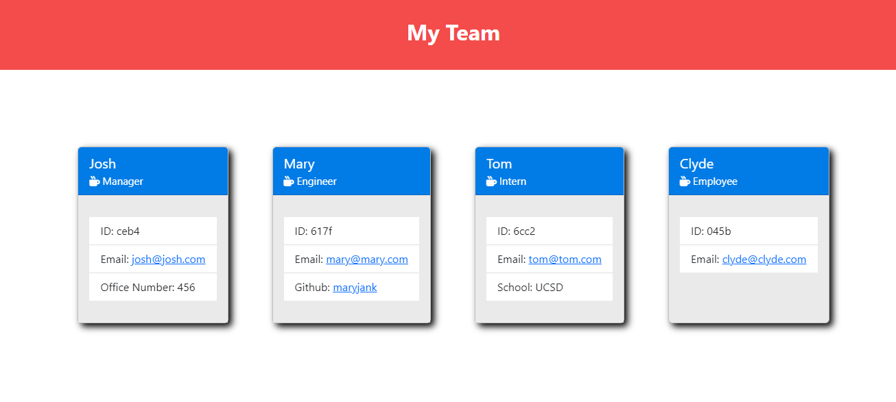

#### Table of Contents

[Work Force Generator](#Work Force Generator)
[User Story](#user-story)
[Motivation](#motivation)
[Preview Photo](#preview-photo)
[Usage](#usage)
[Git Hub URL](#git-hub-URL)
[Author](#author)
[Email](#email)
[License](#license)
[Badge](#badge)
## [Work Force Generator

This project can be used to create cards for employees such as Engineers, Managers, Interns and regular Employees to show specific information.

## User Story

The user can select the job family and then will be prompted through multiple questions. Once those questions are answered, the generator will create a html page with all content.

## Motivation

I created this project to illustrate my skillset utilizing node, object oriented javascript, css and html.
## Preview Photo

## Usage

They can use it to create their team.

## Git Hub URL

https://github.com/joshjankowski

## Author

Josh Jankowski

## Email

[mailto](mailto:joshjankowski@gmail.com)

## License

This project is protected by the ISC license. Copyright J Cubed LLC

## Badge

